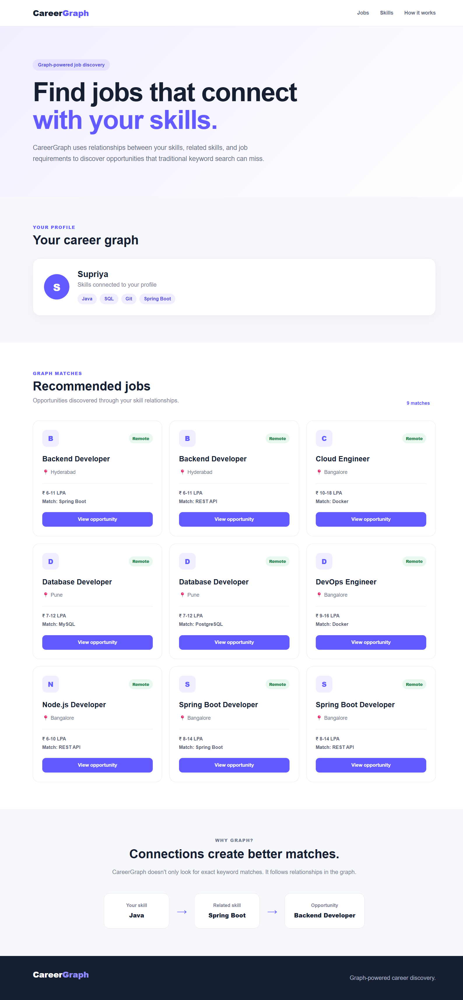
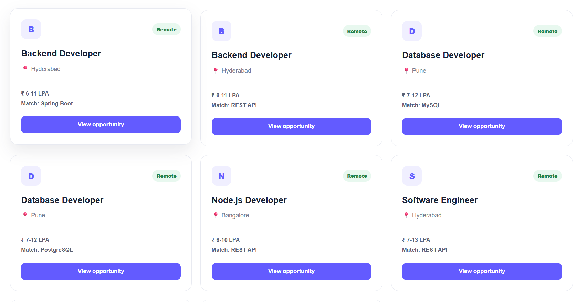

# CareerGraph

CareerGraph is a graph-powered job discovery application that connects a user's skills with relevant job opportunities through relationships stored in a graph database.

Instead of relying only on exact keyword matching, CareerGraph follows relationships between skills and discovers jobs through connected skills.

---

## 🚀 Live Demo

👉 [View CareerGraph Live](https://careergraph-client.onrender.com/)

### Backend API

👉 [CareerGraph API](https://careergraph-2y2e.onrender.com/)

---


# 📸 Screenshots

## CareerGraph Dashboard



## Graph-Powered Job Recommendations



---

## 📌 Problem Statement

Traditional job search systems often depend heavily on keyword matching.

For example, a candidate may have:

- Java
- SQL
- Git
- Spring Boot

while a job may require:

- Spring Boot
- REST API
- MySQL
- Docker

A simple keyword search may fail to identify useful connections between these skills.

CareerGraph models these relationships explicitly using a graph database and uses graph traversal to discover relevant job opportunities.

---

# 💡 Why a Graph Database?

CareerGraph is fundamentally a relationship-oriented problem.

The important question is not only:

> Which jobs contain the word Java?

The more interesting question is:

> Which jobs are connected to this user's skills through related skills and job requirements?

For example:

```text
User
  |
  | HAS_SKILL
  ↓
Java
  |
  | RELATED_TO
  ↓
Spring Boot
  |
  | REQUIRES
  ↓
Backend Developer
```

---

This represents a multi-hop graph traversal:

User → Skill → Related Skill → Job

A relational database could represent this information using multiple tables and JOIN operations, but graph databases make relationship traversal more natural and easier to extend.

---

# 🎯 Use Case

CareerGraph helps candidates discover job opportunities based on their existing skills.

The application supports:

- User skill profiles
- Job discovery
- Direct skill matching
- Related skill matching
- Multi-hop graph traversal
- Job recommendations

---

# 🗃️ Graph Data Model

## Nodes

The main node types are:

- User
- Skill
- Job
- Company
- Category

## Relationships

```text
User ──HAS_SKILL──────> Skill

User ──INTERESTED_IN──> Category

Skill ──RELATED_TO────> Skill

Job ──REQUIRES───────> Skill

Job ──POSTED_BY──────> Company

Job ──BELONGS_TO─────> Category